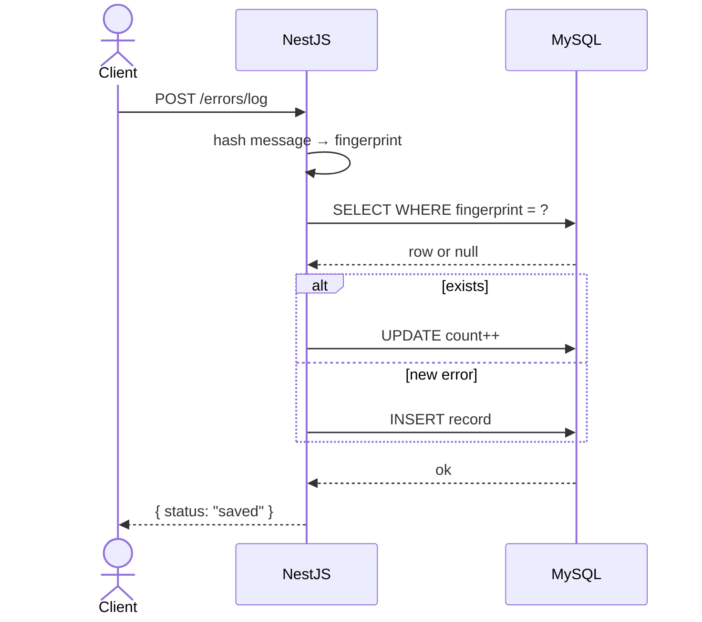
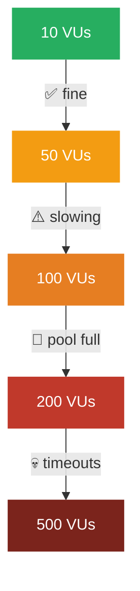

# error-logger-naive-to-production

A simple synchronous error logger — the way most engineers write their first version.

Built intentionally to **break under load** and understand why.

***

## Architecture


Every request → NestJS → MySQL → response. Nothing in between.

***

## How a Request Flows



The API **waits for MySQL** before responding. Two round trips every time.

***

## Stack

| Layer | Tech |
|---|---|
| HTTP | NestJS |
| ORM | TypeORM |
| Database | MySQL |
| Load Testing | k6 |
| Observability | Prometheus + Grafana |

***

## Project Structure

```
src/
├── errors/
│   ├── errors.controller.ts
│   ├── errors.service.ts
│   ├── errors.entity.ts
│   └── dto/log-error.dto.ts
├── app.module.ts
└── main.ts
```

***

## The Core Logic

```typescript
// errors.service.ts
async log(dto: LogErrorDto): Promise<void> {
  const fingerprint = createHash('sha256')
    .update(dto.message).digest('hex').slice(0, 64);

  // Two DB calls on every request — blocks until both complete
  const existing = await this.repo.findOne({ where: { fingerprint } });

  if (existing) {
    existing.count += 1;
    existing.lastSeenAt = new Date();
    await this.repo.save(existing);
  } else {
    await this.repo.save({ message: dto.message, stackTrace: dto.stackTrace, fingerprint, count: 1 });
  }
}
```

***

## What Breaks and When



| VUs | p95 Latency | Error Rate | Why |
|---|---|---|---|
| 10 | ~20ms | 0% | Works fine |
| 50 | ~80ms | 0% | DB pool filling |
| 100 | ~300ms | 2% | Pool limit (30) reached |
| 200 | ~800ms | 15% | Requests queuing for connections |
| 500 | ~1800ms | 60%+ | System overwhelmed |

***

## Why It Breaks

**Problem 1 — Race condition**

Two concurrent requests with the same fingerprint both call `findOne` before either inserts. Both see null. Both try to INSERT. One fails with a duplicate key error.

**Problem 2 — Pool exhaustion**

MySQL pool limit is 30. At 100 concurrent users, all 30 connections are held. Every new request waits. Latency climbs. Then timeouts start.

**Problem 3 — Synchronous hot path**

The API cannot respond until MySQL finishes. At 200 VUs that means ~800ms per request. The user is waiting for your database.

***

## Running the Tests

```bash
# Start stack
docker compose up -d

# Default load ramp
k6 run -o experimental-prometheus-rw load-test.js

# Sudden spike
k6 run --env SCENARIO=spike -o experimental-prometheus-rw load-test.js
```

Open Grafana at `http://localhost:3000`

***

## What This Taught Me

- Synchronous DB writes in the HTTP path are a hard ceiling on concurrency.
- `findOne + insert` is never safe under concurrent traffic — it is not atomic.
- DB connection pool size is a real constraint, not a config detail.
- You cannot debug production without metrics. This repo has none.

***

## The Fix

👉 **[high-throughput-error-ingestion](https://github.com/yourusername/high-throughput-error-ingestion)**

Same problem. Redis + BullMQ + async worker. p95 drops from 1800ms to 8ms at 500 VUs.
